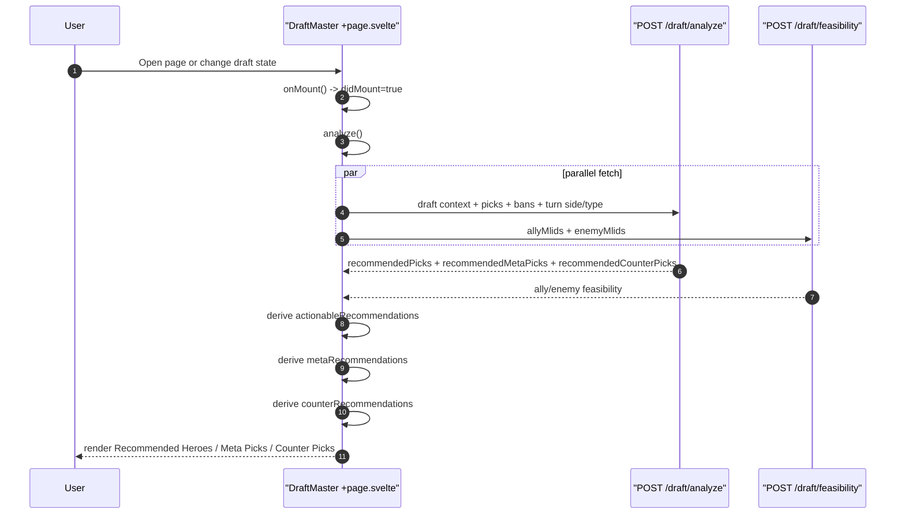
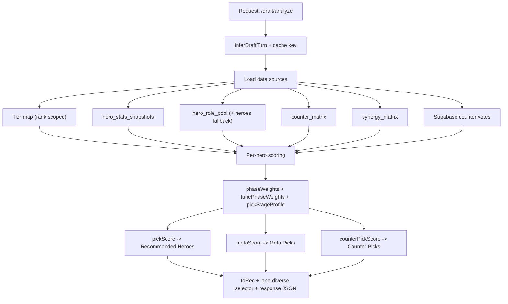

# MLBB Coach Monorepo

TypeScript-only pnpm + Turborepo starter for MLBB analysis tools.

## Apps

- `apps/web` - SvelteKit dashboard
- `apps/api` - Hono BFF API
- `apps/worker` - BullMQ ingestion/compute workers

## Packages

- `packages/shared` - shared contracts, zod schemas, scoring helpers
- `packages/db` - Drizzle schema + migrations + db client
- `packages/ui` - reusable Svelte UI components + theme tokens
- `packages/config` - shared tsconfig/eslint/prettier base

## Prerequisites

- Node.js 20+
- pnpm latest
- Docker

## Setup

1. Copy env file:
   - `cp .env.example .env`
2. Install deps:
   - `pnpm i`
3. Start everything:
   - `pnpm dev`
   - or `pnpm services:start`
4. Stop everything:
   - `pnpm services:stop`

`pnpm dev` automatically:
1. starts Postgres + Redis from `infra/docker-compose.yml`
2. waits for services to become reachable
3. runs DB migrations
4. runs worker + api + web in parallel

## URLs

- web: http://localhost:5173
- api health: http://localhost:8787/health

## CI/CD (GitHub Actions + Blue/Green)

- CI workflow: `.github/workflows/ci.yml` (lint + typecheck + build).
- CD workflow: `.github/workflows/deploy.yml` (build/push GHCR images + VPS deploy).
- Blue/green infra files: `infra/bluegreen/`.
- Deployment switch script: `scripts/deploy-bluegreen.sh`.

Required GitHub Secrets:

- `VPS_HOST`
- `VPS_USER`
- `VPS_SSH_KEY`
- `GHCR_PAT` (optional jika image private dan pull dari VPS)

Production bootstrap on VPS:

1. `cp .env.production.example .env.production`
2. Fill secrets in `.env.production`
3. Set `IMAGE_PREFIX` and `IMAGE_TAG`
4. Run `bash scripts/deploy-bluegreen.sh`

Production hardening:

- Set `CORS_ORIGINS` ke domain produksi (contoh: `https://mlbb-tools.example.com`).
- Untuk TLS, gunakan `infra/bluegreen/nginx.ssl.conf` setelah sertifikat Let’s Encrypt tersedia.
- Expose hanya `80/443` dari firewall.

## Draft Master Intelligence

### Advanced capabilities

- Adaptive draft recommendations with stage-aware weighting (early, mid, late pick).
- Three recommendation channels in one flow:
  - Recommended Heroes (main decision list)
  - Meta Picks (tier/stat power oriented)
  - Counter Picks (enemy-context + community driven)
- Lane-aware filtering:
  - blocks impossible lane overlaps from committed single-lane heroes
  - boosts missing-lane coverage and role balance
- Stability controls to reduce recommendation jitter between turns:
  - phase profile blending
  - confidence/reliability gating for counter and community signals
- Live draft orchestration:
  - ranked and tournament flows
  - auto-refresh recommendations on every draft state change
  - lane drag-and-drop before final matchup analysis

### Frontend recommendation flow

### API scoring and data pipeline

## Milestone coverage

- M0: scaffold + one-command local dev
- M1: hero meta import + heroes endpoints + dashboard shell
- M2: stats ingest fallback + stats endpoint + virtualized stats UI
- M3: tier compute + tier endpoint + tier page
- M4: counters endpoint + counter page
- M5: draft analyze endpoint + draft page

## Notes

- Stats ingest now uses GMS `POST /api/gms/source/{sourceId}/{endpoint}` per timeframe endpoint (configurable via `.env`).
- GMS rank `bigrank` is normalized into `rankScope` snapshots; canonical `/stats` data uses priority: `all_rank(101) -> mythic_glory -> mythic_honor -> mythic -> ...`.
- If GMS fetch fails, worker falls back to deterministic mock stats and keeps running.
- Hero metadata import source uses `HERO_META_SOURCE=gms` (GMS only, no file fallback mode).
- Hero import is idempotent via upsert on `mlid`.
- Refresh local metadata snapshot file: `pnpm meta:refresh`.
- Counter blend weights are configurable via env:
  - `COUNTERS_BLEND_WEIGHTS` (example: `community=55%,counter=25%,tier=20%`)
  - `COUNTERS_BLEND_SOURCES` (example: `community,counter,tier`)
  - `COUNTERS_COVERAGE_MULT_MIN` (0..1)
- Draft Master counter tuning is configurable via env:
  - `DRAFT_COUNTER_LANE_SATURATION_PENALTY_MAX`, `DRAFT_COUNTER_FLEX_EARLY_BONUS`, `DRAFT_COUNTER_FLEX_MID_BONUS`
  - `DRAFT_COUNTER_UNCERTAINTY_MAX`, `DRAFT_COUNTER_COMMUNITY_DAMPING_MIN`, `DRAFT_COUNTER_COMMUNITY_VOTE_REF`
  - `DRAFT_COUNTER_DIVERSITY_ROLE_PENALTY`, `DRAFT_COUNTER_DIVERSITY_ARCHETYPE_PENALTY`, `DRAFT_COUNTER_DIVERSITY_LANE_PENALTY`, `DRAFT_COUNTER_DIVERSITY_FLOOR`
